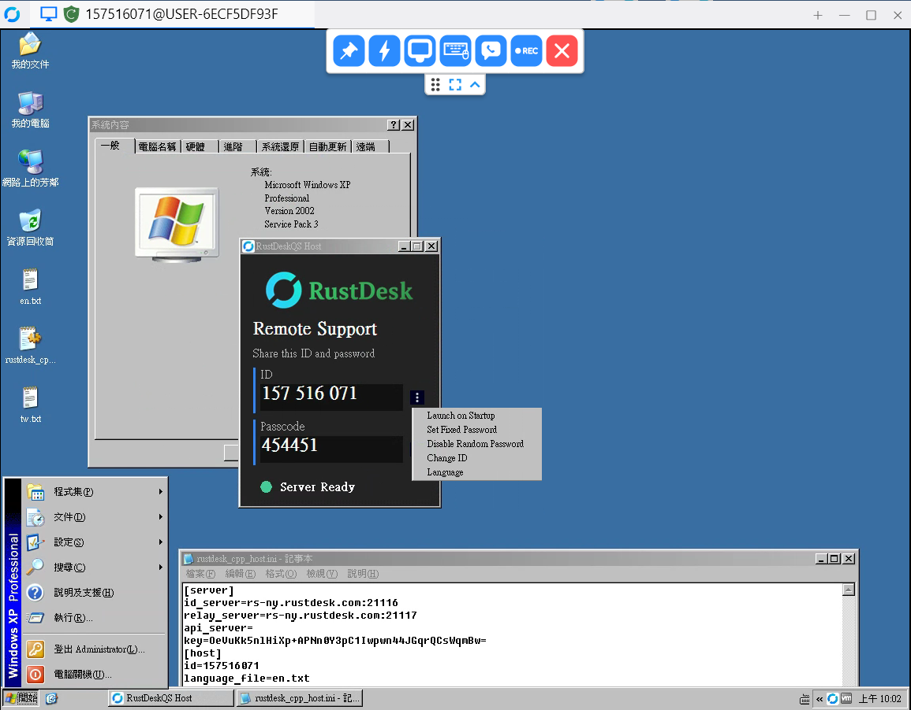
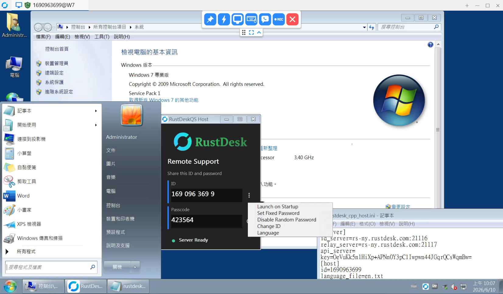
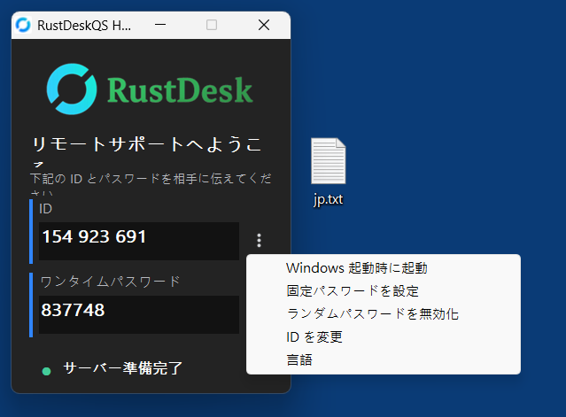
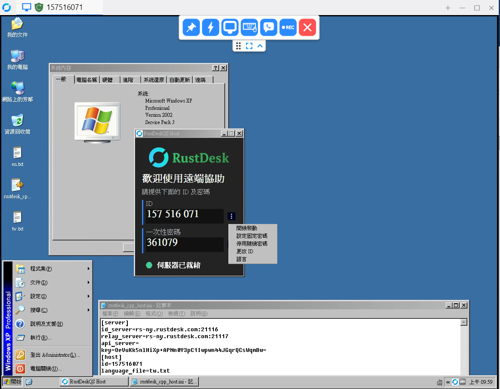
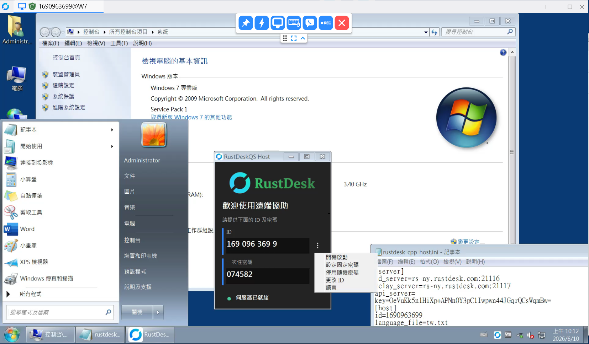

# RustDesk QuickHost

Native C++ host-only RustDesk-compatible remote support client for Windows XP / 7 / 10 / 11.


[Releases](https://github.com/Terence0816/RustDesk-QuickHos/releases) |
[Latest Official Build v1.0.0.0](https://github.com/Terence0816/RustDesk-QuickHos/releases/tag/v1.0.0.0) |
[GPL-3.0 License](LICENSE)

English | [繁體中文](#繁體中文)

RustDesk QuickHost is a lightweight **RustDesk-compatible host-only remote support client** for Windows.

It is rewritten from the ground up in native C++ and is designed for computers that only need to be remotely controlled.

> This project is compatible with RustDesk-style remote support usage, but it is **not an official RustDesk client**.

## Version History

### v1.0.0.0

- Initial public release.
- Native C++ Win32 host-only implementation.
- Supports Windows XP / Windows 7 / Windows 10 / Windows 11.
- Added system tray resident mode.
- Added auto start with Windows.
- Added fixed password support.
- Added option to disable random one-time password.
- Added custom RustDesk ID support.
- Added INI-based RustDesk server configuration.
- Added self-hosted RustDesk server support.
- Added built-in Traditional Chinese and English language templates.
- Added custom `.txt` language file support.

## Highlights

- Native C++ Win32 implementation
- Host-only remote support client
- Lightweight single executable
- Supports Windows XP / Windows 7 / Windows 10 / Windows 11
- System tray resident mode
- Auto start with Windows
- Fixed password support
- Option to disable random one-time password
- Custom RustDesk ID
- INI-based configuration
- Custom ID server, relay server, API server and server key
- Self-hosted RustDesk server support
- Force relay option
- Preferred video codec setting
- FPS and bitrate configuration
- Built-in Traditional Chinese and English language files
- Custom `.txt` language file support
- First run automatically generates `rustdesk_cpp_host.ini`, `en.txt`, and `tw.txt`

## Repository Layout

- `src/`: main native C++ Win32 source code
- `resources/`: application icons and UI resources
- `assets/screenshots/`: README screenshots
- `docs/`: technical notes
- `rustdesk_cpp_host.ini.example`: sample runtime configuration

Local/private build scripts are intentionally not included because they are specific to the author's local build environment.

## Screenshots

### Windows XP English UI



### Windows 7 English UI



### Custom Japanese Language Example



The screenshot above demonstrates a Japanese UI created by manually translating the built-in `tw.txt` or `en.txt` language template into a custom `jp.txt` file.
Users can create their own language file for other languages without rebuilding the program.

## INI Configuration

On first run, the program automatically generates:

```text
rustdesk_cpp_host.ini
en.txt
tw.txt
```

The default `rustdesk_cpp_host.ini` connects to the official RustDesk public server.
You can edit `id_server`, `relay_server`, `api_server`, and `key` to use your own self-hosted RustDesk server.

Example:

```ini
[server]
id_server=rs-ny.rustdesk.com:21116
relay_server=rs-ny.rustdesk.com:21117
api_server=
key=

[host]
id=
language_file=tw.txt
temporary_password_length=6
random_password_enabled=1
fixed_password_protected=
force_relay=1
preferred_codec=h264
video_fps=30
video_bitrate_kbps=20000
```

## Language Files

Language files are simple `.txt` files.

Built-in templates:

```text
tw.txt
en.txt
```

To create another language, copy one of the generated language templates and translate only the values on the right side.
Keep the keys on the left side unchanged.

Example:

```ini
tray_show_main=Show Main Window
tray_exit=Exit
```

To use a custom Japanese file, save it as:

```text
jp.txt
```

Then set it in `rustdesk_cpp_host.ini`:

```ini
language_file=jp.txt
```

## Download

- Release page: [Releases](https://github.com/Terence0816/RustDesk-QuickHos/releases)
- Official `v1.0.0.0` build: [RustDeskQS.exe](https://github.com/Terence0816/RustDesk-QuickHos/releases/tag/v1.0.0.0)
- GitHub release assets show the current download count for the official build.

## Search Keywords

RustDesk compatible host, RustDesk host-only client, RustDesk QuickHost, remote support client, remote desktop host, self-hosted RustDesk server, Windows XP remote support, Windows 7 remote support, native C++ Win32 remote desktop, custom language txt, INI configuration, RustDesk relay server, RustDesk ID server

## Disclaimer

This project is an independent implementation.

It is not affiliated with, endorsed by, or officially maintained by RustDesk.  
RustDesk is a trademark of its respective owner.

Use this software only on computers you own or have permission to access.

## License

This repository is released under the GNU General Public License v3.0. See [LICENSE](LICENSE).

---

# 繁體中文

RustDesk QuickHost 是一個輕量化的 **RustDesk 相容 Host-only 被控端遠端協助工具**。

本專案使用原生 C++ 從底層重新實作，主要設計給只需要被遠端連線控制的 Windows 電腦使用。

> 本專案相容 RustDesk 風格的遠端協助用途，但不是 RustDesk 官方用戶端。

## 版本更新紀錄

### v1.0.0.0

- 首次公開版本。
- 原生 C++ Win32 Host-only 被控端實作。
- 支援 Windows XP / Windows 7 / Windows 10 / Windows 11。
- 支援右下角常駐。
- 支援開機自動啟動。
- 支援固定密碼。
- 支援停用隨機一次性密碼。
- 支援自訂 RustDesk ID。
- 支援透過 INI 設定 RustDesk 伺服器。
- 支援自架 RustDesk Server。
- 內建繁體中文與英文語言模板。
- 支援外部 `.txt` 自定義語言檔。

## 功能特色

- 原生 C++ Win32 實作
- Host-only 被控端遠端協助工具
- 輕量化單一執行檔
- 支援 Windows XP / Windows 7 / Windows 10 / Windows 11
- 支援右下角常駐
- 支援開機自動啟動
- 支援固定密碼
- 可停用隨機一次性密碼
- 可自訂 RustDesk ID
- 使用 INI 設定檔
- 可自訂 ID Server、Relay Server、API Server 與 Server Key
- 支援自架 RustDesk Server
- 可強制走 Relay
- 可指定影像編碼
- 可設定 FPS 與影像位元率
- 內建繁體中文與英文語言檔
- 支援外部 `.txt` 自定義語言檔
- 第一次執行會自動產生 `rustdesk_cpp_host.ini`、`en.txt`、`tw.txt`

## 儲存庫結構

- `src/`：主要 C++ Win32 原始碼
- `resources/`：程式圖示與 UI 資源
- `assets/screenshots/`：README 使用的畫面截圖
- `docs/`：技術說明
- `rustdesk_cpp_host.ini.example`：執行時設定檔範例

本機編譯腳本未包含於儲存庫中，因為它們與作者本機建置環境高度相關。

## 畫面截圖

### Windows XP 中文介面



### Windows 7 中文介面



### 自定義日文語言範例


`custom-japanese-language.png` 示範的是使用者將內建的 `tw.txt` 或 `en.txt` 語言模板自行翻譯後另存為 `jp.txt`，即可讓程式切換成日文介面。
使用者也可以用同樣方式建立其他國家的語言檔，不需要重新編譯主程式。

## INI 設定

程式第一次執行時會自動產生：

```text
rustdesk_cpp_host.ini
en.txt
tw.txt
```

預設產生的 `rustdesk_cpp_host.ini` 目前會連到 RustDesk 官方公開伺服器。
使用者可以自行修改 `id_server`、`relay_server`、`api_server` 與 `key`，改成自己的 RustDesk 自架伺服器專用版本。

範例：

```ini
[server]
id_server=rs-ny.rustdesk.com:21116
relay_server=rs-ny.rustdesk.com:21117
api_server=
key=

[host]
id=
language_file=tw.txt
temporary_password_length=6
random_password_enabled=1
fixed_password_protected=
force_relay=1
preferred_codec=h264
video_fps=30
video_bitrate_kbps=20000
```

## 語言檔

語言檔是簡單的 `.txt` 文字檔。

內建模板：

```text
tw.txt
en.txt
```

如需建立其他語言，可複製其中一個自動產生的語言模板，並只翻譯右邊的文字。
左邊的 key 必須保持不變。

範例：

```ini
tray_show_main=顯示主頁
tray_exit=離開
```

如果要使用日文語言檔，可以另存成：

```text
jp.txt
```

然後在 `rustdesk_cpp_host.ini` 設定：

```ini
language_file=jp.txt
```

## 下載

- Release 頁面：[Releases](https://github.com/Terence0816/RustDesk-QuickHos/releases)
- 官方 `v1.0.0.0` 版本：[RustDeskQS.exe](https://github.com/Terence0816/RustDesk-QuickHos/releases/tag/v1.0.0.0)
- GitHub Release Assets 會顯示目前官方版本的下載次數。

## 搜尋關鍵字

RustDesk 相容被控端、RustDesk Host-only、遠端協助工具、遠端桌面被控端、自架 RustDesk Server、Windows XP 遠端協助、Windows 7 遠端協助、C++ Win32 遠端工具、自定義語言 txt、INI 設定檔、RustDesk Relay Server、RustDesk ID Server

## 免責聲明

本專案為獨立實作。

本專案並非 RustDesk 官方用戶端，也未受到 RustDesk 官方維護、認可或背書。  
RustDesk 為其各自擁有者之商標。

請只在您擁有或已獲授權的電腦上使用本軟體。

## 授權

本儲存庫使用 GNU General Public License v3.0 授權，詳見 [LICENSE](LICENSE)。
